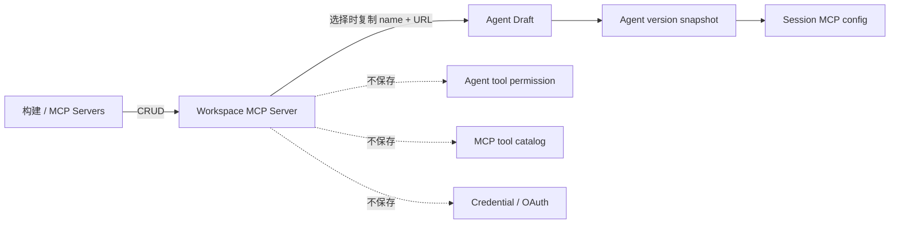

# 工作区 MCP Servers

## 职责

Workspace MCP Server 是“构建”域中的可复用远程 MCP 配置目录项，只保存名称、URL transport endpoint、工作区归属和时间信息。凭据、OAuth、Agent 工具权限以及工具目录快照不属于该资源。

Agent 版本仍是运行时配置事实来源：用户选择工作区目录项时，前端复制 `{name,type:"url",url}` 到 Agent 的 `mcp_servers`，并创建同名 `mcp_toolset`。Agent 不保存目录项 ID，因此目录项后续修改或删除不会改变已有 Agent 版本，也不需要在删除时检查 Agent 使用情况。



## Console API

路由挂在平台会话鉴权保护的 `/api/console/organizations/{orgUuid}` 下：

- `GET|POST /workspaces/{workspaceId}/mcp_servers`
- `GET|POST|DELETE /workspaces/{workspaceId}/mcp_servers/{mcpServerId}`

列表只返回未删除的目录项，支持 `search`、`limit` 和 `page` 游标。跨组织或跨工作区访问统一返回 404；`default`、workspace external ID 与 UUID 都可作为当前已认证 workspace 的路径身份。平台镜像恢复出的组织别名只在受信 `platform.claude.com` host 接受。

创建与更新请求：

```json
{
  "name": "internal-docs",
  "url": "https://docs.example.com/mcp"
}
```

成功响应包含 `id`、`name`、`transport_type`、`url` 和时间字段。名称 trim 后必须符合 Agent MCP 名称规则；endpoint 通过统一规范化逻辑处理 scheme、DNS 大小写、默认端口与根路径，并拒绝凭据、fragment、非 HTTP(S) 或超过 2048 字节的值。

错误响应属于 Console API 合同，使用 `{error,message}`，不复用 `/v1` 的 Anthropic-compatible error envelope。资源包只在最终 Console 边界记录内部错误；endpoint、查询条件和请求体不写入运行日志。

## 持久化与删除

表名为 `mcp_servers`，使用 identity 内部主键、UUID 业务身份和 `mcp_...` external ID。新建资源使用 `mcp_` 前缀；已有 `mcpsrv_` ID 保持兼容，不做数据迁移。所有运行时 SQL 通过 `MCPServerMapper` 执行；表中不建立外键。

- `organization_uuid`、`workspace_uuid` 明确租户边界。
- `transport_type` 当前固定为 `url`。
- 未软删除的目录项在同一工作区内名称唯一、规范化 endpoint 唯一；软删除后可以重新创建同名或相同 endpoint 的新目录项。
- Delete 直接设置 `deleted_at` 软删除目录项，不扫描或修改 Agent 配置。新目录项拥有独立 ID，已有 Agent 不会自动切换到新记录。
- 列表按 `(created_at, uuid)` 倒序游标分页，搜索使用大小写不敏感的名称或 endpoint 子串。

## 前端边界

管理入口位于 Build 目录：

- `/workspaces/{workspaceId}/mcp-servers`
- `/workspaces/{workspaceId}/mcp-servers/new`
- `/workspaces/{workspaceId}/mcp-servers/{mcpServerId}`

管理页采用与 Skills、Files 一致的资源列表：表格行用于选择目录项，行末更多菜单承载编辑和删除操作。创建与编辑复用原自定义 MCP 的居中表单和输入校验，右侧资源面板只用于展示详情。选择目录项时同步详情 URL，关闭面板回到列表 URL；搜索框复用共享资源控件，与 Managed Agents 资源列表保持高度、圆角和键盘交互一致，并保留游标分页。

Agent Create/Edit 的“自定义 MCP”页签加载当前未删除的目录项并提供选择、重试与新标签页创建入口，不提供内联名称或 URL 输入。选择时明确提示名称和 endpoint 会复制到 Agent 配置，窗口重新获得焦点时刷新列表。已有 Agent 的历史 MCP 直接来自 Agent snapshot，不要求能在工作区目录中反查；工作区候选与现有 Agent MCP 同名但 URL 不同时，候选不允许添加并明确展示冲突提示。

前端 Workspace MCP Server DTO 与 Console client 位于共享 API 边界，管理页与 Agent 编辑器分别依赖该边界。请求显式发送当前路由 workspace 的 `X-Workspace-ID`；管理路由在 WorkspaceProvider 与 URL workspace 对齐后才开始查询，避免直接打开其他工作区路由时读取旧上下文。

## 验收

- Console API 覆盖规范化、重复冲突、跨租户 404、直接删除、游标分页和受信组织别名。
- Mapper 单测覆盖每个方法、动态 SQL 分支、参数顺序、endpoint/search 敏感参数、多行/nullable、`sql.ErrNoRows` 与执行错误；真实 PostgreSQL 测试覆盖 `RETURNING`、工作区隔离和软删除。
- 管理页覆盖资源列表、居中创建/编辑表单、右侧详情面板、编辑/删除菜单与游标分页。
- Agent 表单覆盖 Directory 失败时仍可选择工作区 MCP、请求体只复制 `{name,type,url}`，以及历史未入库 MCP 的 Rendered 保存。
