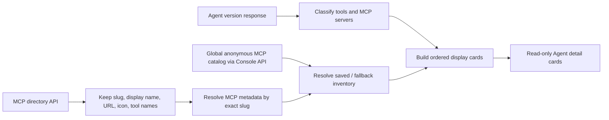

# Agent detail MCP 与工具展示

> 当前实现状态：静态 Directory metadata 与后端成功快照 catalog 已同时落地。手动同步刷新、持久化和网络边界见 [Agent Detail MCP 工具目录手动刷新设计](../mcp-tool-catalog-discovery.md)。

## 目标与边界

Agent 详情页的 `MCPs and tools` 区域只负责展示当前 agent 版本的工具配置，不在详情态修改权限。配置仍由现有 `/v1/agents/{id}?beta=true` 提供；标题和图标由静态 MCP Directory 补全，工具 inventory 优先使用后端动态 catalog。该能力不改变 Anthropic 兼容 API 的响应结构。

## 展示模型

页面按以下固定顺序生成可并存的卡片：

1. 第一项 `type` 以 `agent_toolset_` 开头的内置 toolset。
2. 所有 `type=custom` 的工具合并成一张 custom tools 卡片。
3. `mcp_servers` 中的每个 server 各一张卡片，并保留原始顺序。

孤立的 `mcp_toolset` 权限配置不会单独生成 MCP 卡片。三类配置都不存在时，Section 只显示 `No MCPs or tools configured.`，不渲染占位卡片。卡片默认折叠；custom 卡片的折叠行显示 `Tools`，内置/MCP 卡片显示 `Tool permissions`。custom tool 行只显示名称和描述，内置/MCP 工具行额外显示只读权限 badge。

当前后端只接受 `agent_toolset_20260401`。为兼容升级前留下的 legacy Agent 配置，详情页把第一个 `agent_toolset_*` 视为当前内置 toolset，使用 `agent_toolset_20260401` 的定义和 subtitle，同时继续读取 legacy `tool_name` 权限字段；这与编辑配置时的 canonicalization 行为一致。引入下一版内置 toolset 时必须先扩充版本化定义和选择规则，不能继续无条件归一化到旧的 current 常量。

当前定义展示固定 Claude Code 2.1.120 的 22 项默认内置工具，与创建/编辑页和后端 `--tools` 清单一致。其中 `web_fetch` 对应 Session Sandbox 内 Claude Code 的 `WebFetch` 客户端工具；详情页不把 Messages API 的模型服务端同名工具或已永久移除的内置 `web_search` 混入该清单。

## MCP 元数据

前端请求：

`GET /api/directory/servers?type=remote&visibility=commercial&sort=popular&limit=500`

成功结果在模块内缓存一小时，并仅保留展示需要的字段，避免长期持有完整目录响应。当前后端 embed 路由不处理 query 参数，因此前端归一化时显式排除非 `remote` 和非 commercial 条目。目录 URL 优先读取 `remote.url`，并兼容 `remote.url_options[0].url`；只有 `url_regex` 或租户字段、没有 concrete URL 的 remote 条目仍保留 slug、图标和工具名，因为最终展示 URL 始终来自 Agent 配置。server 元数据按以下优先级解析：

1. `tunnel:` server：显示配置 URL 的 host（解析失败时使用名称后缀），工具清单为空。
2. MCP 目录中 `slug` 与配置 `name` 严格相等的记录；URL 始终使用 agent 当前配置值。
3. GitHub、Slack 内置元数据。
4. 对未知 server 将配置名称 humanize，工具清单为空。

目录请求失败时不阻塞详情页：保留 fallback 元数据。权限配置中的 `configs[].name` 不会被误当成目录工具清单。

动态 inventory 由以下 Console API 提供：

- `GET /api/console/organizations/{orgUuid}/workspaces/{workspaceId}/agents/{agentId}/mcp_tool_catalogs?version={N}`
- `POST /api/console/organizations/{orgUuid}/workspaces/{workspaceId}/agents/{agentId}/mcp_tool_catalogs/refresh?version={N}`

路由中的 organization/workspace 用于验证当前用户有权读取该 Agent/version，并从 Agent 配置取得 endpoint；它们不是 catalog identity。后端匿名 catalog 以 `transport_type + normalized endpoint_url` 全局唯一，相同 endpoint 可以跨 Agent、workspace 和 organization 复用。响应不暴露 endpoint 身份字段，前端始终按当前版本的 `server_name` 合并展示数据，也不能直接查询任意全局 endpoint。

工具清单优先级为成功 catalog（包括真实空数组）> Directory 非空工具名 > unknown。动态成功使用 replace 语义，不与 Directory 做 union。数据库不存在对应 endpoint 时 GET 返回 `tools=null`，count 显示 `—`；只有成功保存的 `tools=[]` 才显示真实 `0`。

GET 只读取数据库，不轮询也不自动连接 MCP。用户点击单张卡片的 Refresh 后，POST 会在后端请求内同步执行匿名 `tools/list`，成功落库后直接返回最终 catalog；前端按请求发起时的 Agent/version scope 替换 TanStack Query cache，避免等待期间切换版本造成串写。常规成功无需第二次 GET；仅当初次 collection GET 已失败、没有完整 merge 基线时，前端才对仍活跃的同一 scope 回源 GET，补齐其他 MCP 已保存快照。刷新期间保留旧列表并禁用所有 MCP Refresh 按钮，失败时显示 error toast 且不覆盖现有工具。浏览器始终不会直连 MCP endpoint。

## 权限计算

内置 toolset 与对应 MCP `mcp_toolset` 共用同一套权限计算；逐工具字段匹配略有差异：

- 内置 toolset 优先匹配 `configs[].name`，缺失时兼容旧字段 `tool_name`；MCP `mcp_toolset` 只匹配 schema 中的 `configs[].name`。
- 重复的逐工具配置与运行时一致，使用第一个匹配项。
- 未命中逐工具配置时使用 `default_config`。
- `enabled=false` 显示为 `Always deny`。
- 其余读取 `permission_policy.type`；缺失或无效值按 toolset 类型回退：内置工具为 `Always allow`，MCP 为 `Always ask`。
- 所有已知工具权限相同则显示该权限；混合时聚合 badge 显示 `Custom`；内置 toolset 没有已知工具时显示默认 `Always allow`。
- MCP 没有已知工具时，聚合 badge 显示对应 `default_config`；没有匹配 `mcp_toolset` 时显示运行时默认的 `Always ask`。

`Custom` 只是一种聚合展示态，不写入 agent 配置。详情页不渲染权限选择器、删除按钮或其他编辑控件。

## 代码边界与验证

- `agents/tools/model.ts`：纯展示模型、目录归一化、权限计算和内置 fallback。
- `agents/tools/api.ts`：MCP Directory 一小时缓存、动态 catalog GET 与 refresh POST。
- `agents/tools/AgentToolsSection.tsx`：TanStack Query、只读卡片、折叠交互、动态状态和手动刷新。
- `agents/detail.tsx`：只选择 Section 空态或挂载工具 feature。

验证覆盖孤立 `mcp_toolset`、未知 MCP、无 concrete URL 的 remote metadata、local 过滤、GitHub/Slack fallback、目录失败、catalog replace/真实空数组、MCP 默认 ask、重复配置 first-wins、deny 派生、混合聚合、三类卡片共存、目录 URL 覆盖、图标失败 fallback、custom 无权限 UI、空态无占位卡片以及历史 Agent 版本的工具区切换。API 测试额外覆盖目录并发去重/成功缓存/失败重试，以及 catalog 的版本 scope、Console context 和同步 refresh；页面/组件测试覆盖成功立即替换、失败保留旧值、pending 按钮状态、空数组覆盖 Directory、初次 GET 失败后补齐完整 collection、pending 期间切换版本不串写 cache，以及多卡片 Refresh accessible name 与 Directory 状态播报。
