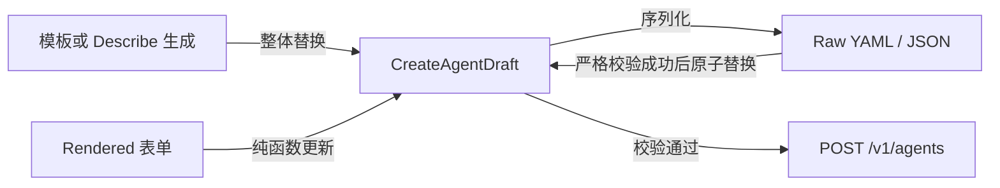

# Create Agent 双模式配置编辑器

## 目标

Create Agent 弹窗同时提供结构化 `Rendered` 表单和 YAML/JSON `Raw` 编辑器。两种视图只编辑同一份 Draft，避免切换视图、切换格式或使用模板时出现字段丢失。

本期沿用既有 `model: string | {id, speed}` 合同，不展示或接受 `model.effort`。后端现有 Agents API 已支持 multiagent、skills、MCP 和工具权限，因此无需新增路由或数据库迁移。

## 状态流

- Draft 是唯一合法配置来源；Rendered 不保存字段副本。
- 进入 Raw 时由 Draft 重新序列化。格式切换也从 Draft 生成，不做文本级 YAML/JSON 转换。
- Raw 输入无效时保留最后一份合法 Draft，禁止切回 Rendered、切换格式、创建，以及通过模板或 Describe 生成覆盖这段未保存文本；生成请求完成时也会重新检查 Raw 状态。
- Raw 合法时，模板选择与 Describe 生成成功会整体替换 Draft、清除错误并折叠 Starting point。
- 关闭弹窗直接丢弃 Draft；生成请求会随组件卸载中止。

## 配置不变量

### Multiagent 与 Skills

- Multiagent 最多包含 20 个引用（`self` 也计入上限）；Agent 引用不得重复，并以 `{type:"agent", id, version}` 固定引用选择时的当前版本。
- Rendered 不主动提供 `self`，但能够展示、保留和移除合法 Raw 中的 `{type:"self"}`。
- Agent 选择器初始加载当前工作区前 20 个候选；输入后以 300ms 防抖按名称调用服务端搜索，符合完整 Agent ID 规则时直接精确读取，不受首屏候选数量限制。
- Skills 最多 20 个；新增选择写入 `{type, skill_id, version:"latest"}`，切换其他 Skill 时保留既有条目原始的可选 `version` 字段。
- 新建 Agent 或 Skill 使用新标签页；原弹窗保留 Draft，并在重新获得焦点时刷新候选项。

### MCP 与 Tools

- “添加 MCP 服务器”沿用 CMA 官方的 Popover 与 Directory 搜索列表，并在同一 Popover 中增加“自定义 MCP”页签作为 OMA 扩展；两个页签共享同一 Draft 写入接口。
- 添加 Directory 或自定义 MCP 必须原子添加 `mcp_servers` 和同名 `mcp_toolset`；删除时原子删除二者。名称 trim 后必填、最长 255 个字符、只允许字母、数字、下划线、连字符和句点、不得包含连续两个下划线 `__`，并以大小写敏感方式在当前 Agent 内保持唯一；URL trim 后必填、最长 2048 个字符，且必须是不含内嵌凭据或 fragment 的 HTTP/HTTPS 绝对地址；每个 Agent 最多配置 20 个 MCP Server。Toolset 与逐工具配置名称必须唯一；MCP 工具名称只允许字母、数字、下划线、连字符和句点，最长 128 个字符。
- 创建阶段只使用 Directory `tool_names`，不调用依赖已创建 Agent ID 的动态 catalog API；自定义 MCP 在创建阶段不探测工具列表，只提供 Toolset 级权限。
- MCP 候选项优先加载 Directory 明确提供的 HTTP/HTTPS 图片 `icon_url`；若该字段是网页或图片加载失败，则依次尝试其同源 `/favicon.ico` 和基于该 Directory 公开主机名的公共 favicon 服务，仍不可用时回退到 Server 图标。自定义 MCP 不向图标组件提供 URL，因此前端不会探测 Agent 配置的 MCP 主机，也不会把自定义主机名发送给第三方。
- Directory 加载失败不阻止使用自定义 MCP；关闭、取消或按 Escape 会丢弃尚未提交的名称和 URL，但不会关闭外层 Agent 编辑弹窗或修改 Draft。
- 内置工具展示当前固定 Claude Code 2.1.120 的 22 项默认工具。列表优先展示原有 7 项：`bash`、`read`、`write`、`edit`、`glob`、`grep`、`web_fetch`，随后展示 `task`、`ask_user_question`、`cron_create`、`cron_delete`、`cron_list`、`enter_plan_mode`、`enter_worktree`、`exit_plan_mode`、`exit_worktree`、`notebook_edit`、`schedule_wakeup`、`skill`、`task_output`、`task_stop`、`todo_write`，默认 `always_allow`。`web_fetch` 映射到 Claude Code 在 Sandbox 内执行的 `WebFetch`，不表示 Messages API 的模型服务端工具；内置 `web_search` 已永久移除，不在 Rendered 或 Raw 合同中；新 MCP 默认 `always_ask`。
- 内置 Toolset 可以整体移除，并可通过“添加内置工具”恢复；恢复操作不会复制已存在的 Toolset。
- Toolset 级权限写入 `default_config` 并清空逐工具覆盖；逐工具权限与默认值一致时不保留冗余覆盖。
- `always_deny` 规范化为 `enabled:false`；`custom` 只是聚合展示状态，不写入 API。
- Rendered 不再提供新增 Custom Tool 的入口；Raw、模板或既有 Agent 中合法的 Custom Tool 仍可在 Rendered 中编辑和移除，并在视图往返时保留。
- Custom Tool 名称必须唯一且符合后端命名规则，描述与 JSON object `input_schema` 必须有效；Schema 输入框保留用户原始文本与光标，仅把合法 JSON 解析结果发布到 Draft。
- Raw codec 使用与 Agents API 一致的 Tool 判别联合：MCP Server 仅接受不含凭据或 fragment 的 HTTP/HTTPS `type:"url"` 地址，权限策略仅接受 `always_allow`/`always_ask`，Custom Tool 的 `input_schema.type` 必须为 `object`；内置 toolset 与同一 MCP Server 的 toolset 均不得重复。

## 数据与组件边界

- 弹窗入口负责模型映射、模型目录加载、创建提交和导航。
- Draft hook 负责 Rendered/Raw/格式状态及严格 codec。
- Rendered 各区块只调用 Draft 纯函数，不直接构造请求体。
- Models、Agents、Skills、Directory 查询经 feature API 适配，展示组件不依赖 Dashboard 页面模块；Models 通过 Anthropic `/v1` SDK client 加载，与 `/api` Console client 保持边界分离。
- 工具权限读语义复用 Agent 详情页模型，写语义集中在创建 Draft 模型中。
- 桌面端弹窗最大宽度为 `880px`，说明列收至 `220px`。该尺寸以改造前 `720px` 创建弹窗和项目 `780px` 宽表单为基准，为 Rendered 模式额外保留说明列空间，同时避免接近 `1120px` Raw 编辑器的视觉体量；窄屏仍使用视口内边距和单列布局。

## 验收

- YAML 与 JSON 可往返全部支持字段，未知顶层字段和 `model.effort` 被拒绝。
- Rendered 可完成 General、Multiagent、Skills、内置工具与 Directory/自定义 MCP 配置；既有 Custom Tool 可继续编辑和移除。
- MCP 与 toolset 始终成对，权限聚合和 deny 序列化与运行时一致。
- 模型、候选 Agent、Skills 和 Directory 加载失败都有可重试状态。
- 弹窗支持键盘导航、浅深主题和窄屏单列布局。
