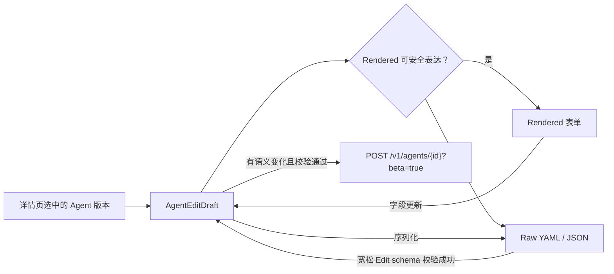

# Edit Agent 双模式配置编辑器

## 目标

Edit Agent 与 Create Agent 使用同一套 `Rendered` 配置区块和 `Raw` YAML/JSON 编辑器。Draft 从详情页当前选中的版本初始化；保存调用现有 Agents 更新接口并创建下一版本，不新增后端路由或数据迁移。

## 状态流

- 支持的标准配置默认进入 `Rendered`；合法但含未知旧字段、未知工具类型、重复 toolset 或无法安全映射的数据默认进入 `Raw`，并禁用 `Rendered`，避免静默丢字段。
- Rendered 和 Raw 共享同一份 Edit Draft。进入 Raw 或切换 YAML/JSON 时均从 Draft 重新序列化，不做文本级转换。
- Raw 语法或顶层 schema 无效时不污染最后合法 Draft，并阻止切换格式、切回 Rendered及保存。
- Rendered 允许表单处于临时无效状态，错误在底部操作区展示；修正前禁止保存，不会自动切换到 Raw。
- 未产生语义变化时禁用“保存新版本”，避免创建无意义版本。

## 保存与并发

- 请求固定携带打开弹窗时最新 Agent 的 `version`，由后端执行乐观并发检查；从历史配置创建新版本时，历史版本只作为 Draft 来源，不作为并发基线。
- `409`、`400` 或网络失败时保留当前 Draft 和弹窗状态，用户可以复制、继续修改或重试。
- 保存成功后关闭弹窗、回到 Agent Config 最新版本，并沿用详情页现有刷新与成功提示。
- 归档 Agent 继续保持只读，不开放编辑入口。

## 字段与组件复用

- General、Multiagent、Skills、Tools 复用 Create Agent 的 `AgentConfigRenderedEditor`，因此搜索、多选、版本固定、MCP Directory/工作区候选页签、权限聚合和 Custom Tool 校验保持一致。
- 编辑既有模型 ID 时保留 `model.speed`；已有 `self`、固定 Agent 版本和固定 Skill 版本会展示并保留。
- MCP Server 与对应 `mcp_toolset` 的添加和删除继续保持原子更新；新增自定义 MCP 只能从当前工作区 Active MCP Servers 中选择，选择时把名称与 URL 复制到新 Agent 版本，不保存资源 ID。
- 既有 Agent 中不属于当前工作区 MCP Servers 的历史配置仍可在 Rendered 中回显、保存和移除；管理资源改名、归档或删除不回写已有 Agent 版本。
- Rendered 不提供新增 Custom Tool 的入口，但继续允许编辑和移除已有 Custom Tool，Raw 往返不丢失其定义。
- 内置工具只展示 `bash`、`read`、`write`、`edit`、`glob`、`grep`；Raw 可继续保留后端合同允许的其他既有配置。

## 布局与验收

- Edit 与 Create 共用 `880px` 最大宽度、近全高滚动区、`220px + 控件列` 的桌面布局和固定底栏；窄屏回退单列。
- 组件测试覆盖默认 Rendered、Raw YAML/JSON、无改动禁用保存、并发失败保留 Draft、固定引用与模型修饰项保留、旧配置回退 Raw。
- 纯函数测试覆盖 Rendered 兼容性判断，避免未来扩展 schema 时误将不可表达的配置带入表单。
